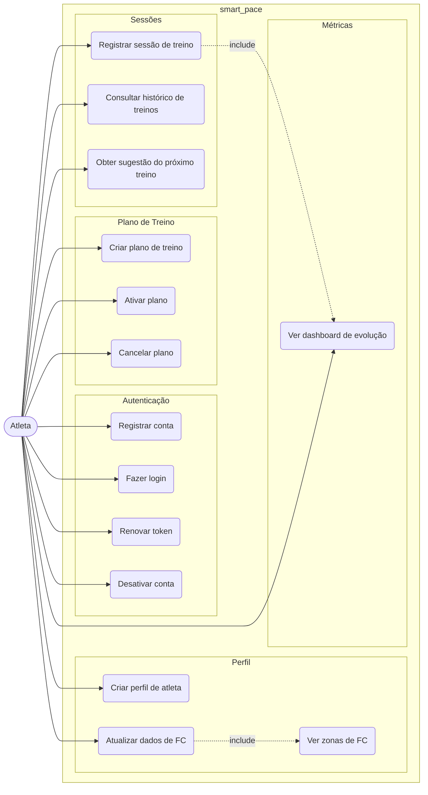
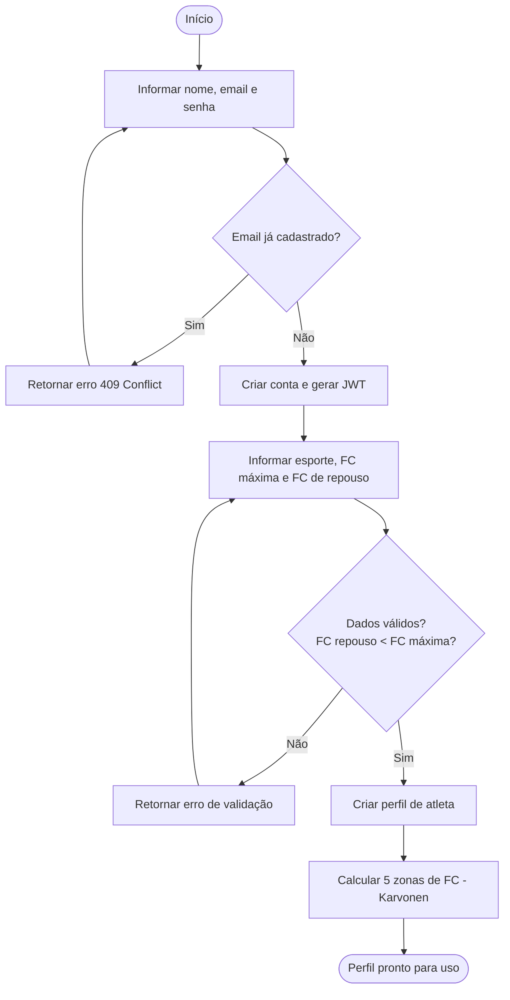
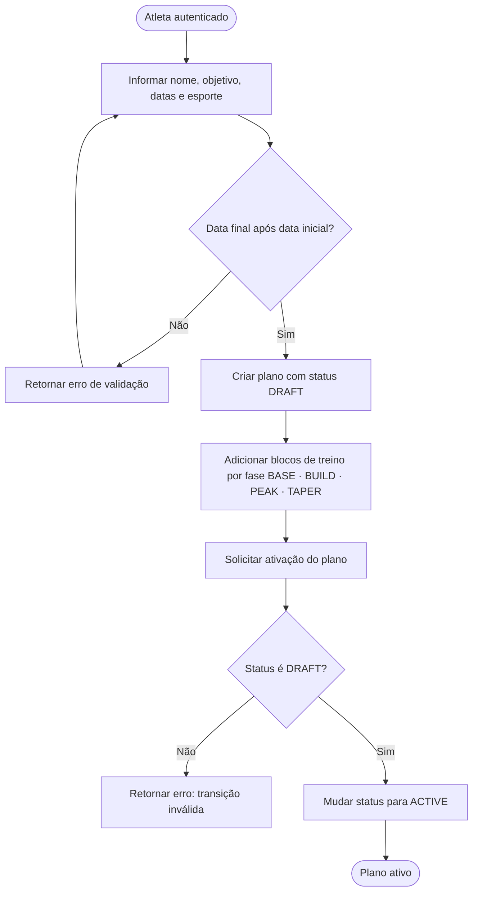
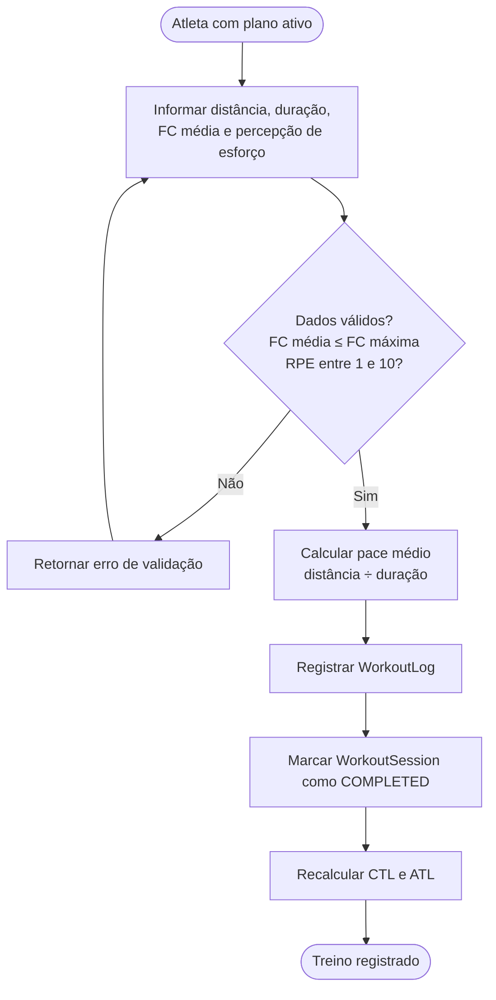
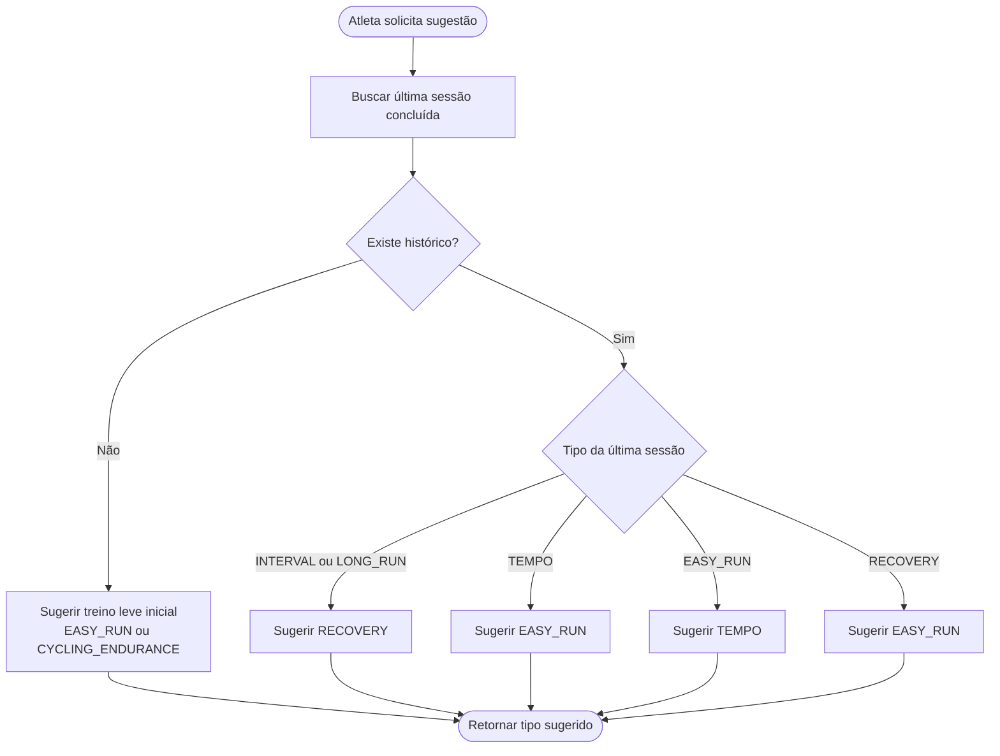
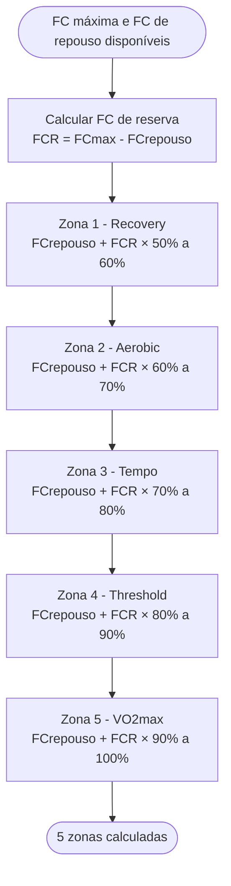

# smart_pace

**Plataforma de Treinos Inteligentes** — sistema para registro, análise e sugestão de treinos de corrida e ciclismo.

---

## Casos de Uso



---

## Diagramas de Atividade

### Registro e Configuração Inicial



---

### Criação e Ativação de Plano de Treino



---

### Registro de Sessão de Treino



---

### Sugestão do Próximo Treino



---

### Cálculo de Zonas de Frequência Cardíaca



---

## Arquitetura

O projeto segue **Clean Architecture** com separação estrita em quatro camadas:

```
smart_pace/
├── domain/          # Regras de negócio puras (stdlib only)
│   ├── entities/    # User, AthleteProfile, TrainingPlan, WorkoutLog...
│   ├── value_objects/  # Pace, Distance, Duration, HeartRate, Vo2max...
│   ├── repositories/   # Interfaces ABC (sem I/O)
│   └── services/    # TrainingZoneCalculator, WorkoutSuggestionEngine
├── application/     # Orquestração de casos de uso
├── infrastructure/  # PostgreSQL, JWT, OTel (implementações)
└── interface/       # FastAPI REST (MVP) · gRPC (futuro)
```

**Stack:** FastAPI · PostgreSQL · SQLAlchemy 2.x async · Pydantic v2 · OpenTelemetry · GCP Cloud Run

---

## Setup Local

```bash
cp .env.example .env
make setup    # instala dependências (uv)
make dev      # sobe PostgreSQL + backend
# → http://localhost:8000/docs
```

## Testes

```bash
make test     # unit + integration (Testcontainers)
make lint     # ruff + mypy
```
